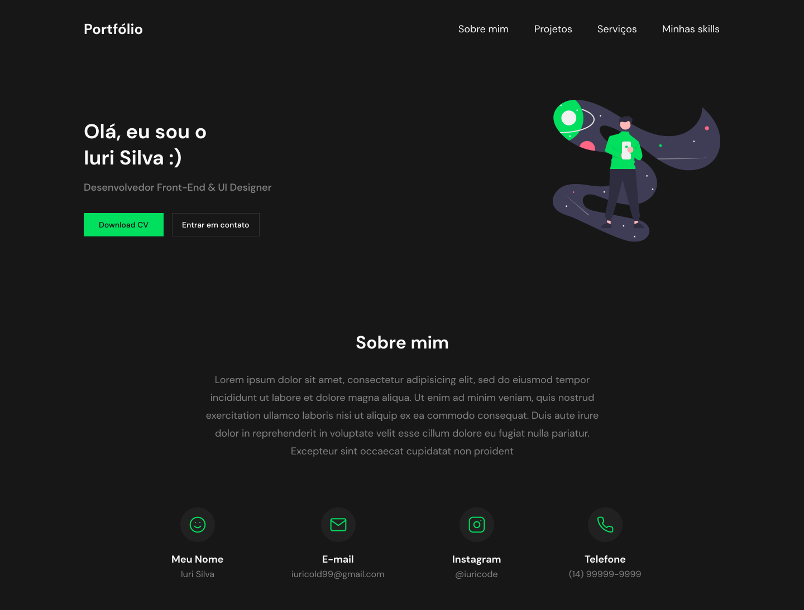

# Desafio 9 - Portfolio

  

### 🚀 Tecnologias
Esse projeto foi desenvolvido com as seguintes tecnologias:

* [html5](https://developer.mozilla.org/pt-BR/docs/Web/HTML)
* [CSS3](https://developer.mozilla.org/pt-BR/docs/Web/CSS)
* [javaScript](https://developer.mozilla.org/pt-BR/docs/Web/JavaScript)
* [TailwindCss](https://tailwindcss.com/)
* [ScrollReveal](https://scrollrevealjs.org/)

  

### 🔖 Layout
Você pode visualizar o layout do projeto através do link abaixo:

[Layout Web](https://www.figma.com/file/Yb9IBH56g7T1hdIyZ3BMNO/Desafios---Codel%C3%A2ndia?node-id=15409%3A2)